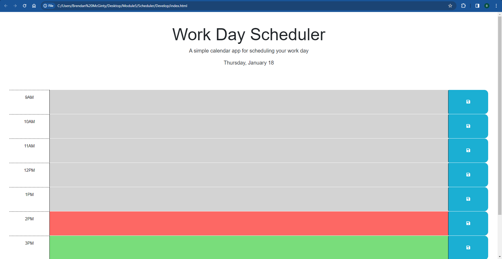

# Scheduler

## Description
This page represents an easy-to-use, interactive work day scheduler for anyone to plan out their work day. Given this is a work day scheduler, the time slots are restricted to 9am-5pm to plan your working hours accordingly.

This page utilizes jquery to allow for dynamic updates based on the current day and current time when accessing the application. The Javascript code for this application utilizes data from dayjs to determine the color coding of the blocks on the page, converting the date and time information to integers which can be used in logic to dictate the color of individual blocks. 

## Usage
To use the application, it is fairly intuitive and user for the user to understand.

When prompted with the homepage of the application, you will see the current date at the top of the page as well as a calendar with blocks representing each hour of the work day from 9am - 5pm.

To fill out a schedule, simply click into any of the hour blocks in the day, and you will be able to edit the text to add custom events. Once an event has been inputted to the calendar, you can hit the 'save' button on the right-hand side of the screen for that same hour-block. Once the save button has been selected, the event will be stored in local storage. This means you can feel free to refresh the application at any time and the events will still be saved to the calendar.

Lastly, the calendar itself has been color-coded to display blocks as "past", "present", or "future" blocks. When you are on the applicaiton, any time-blocks for past hours in the current day will be displayed as grey, the current hour will be displayed as red, and future hours will be displayed as green.   

## Screenshots

## Link to Deployed App

## Installation
N/A

## License
This project is licensed under the [MIT License](./LICENSE)

## Credits
N/A